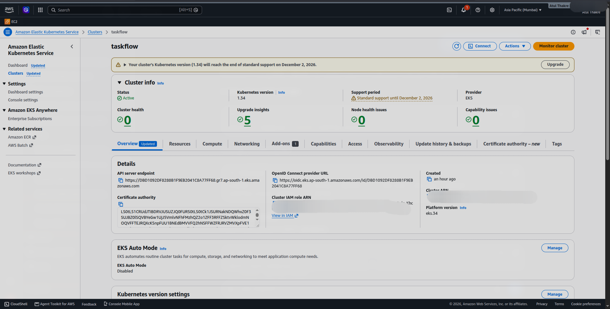
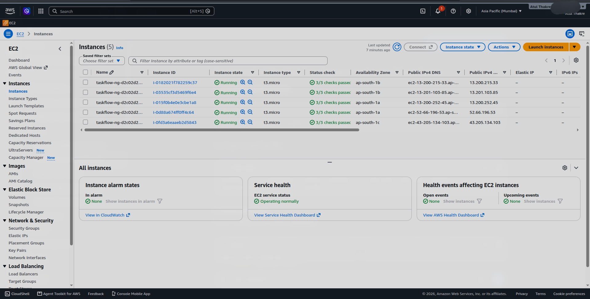
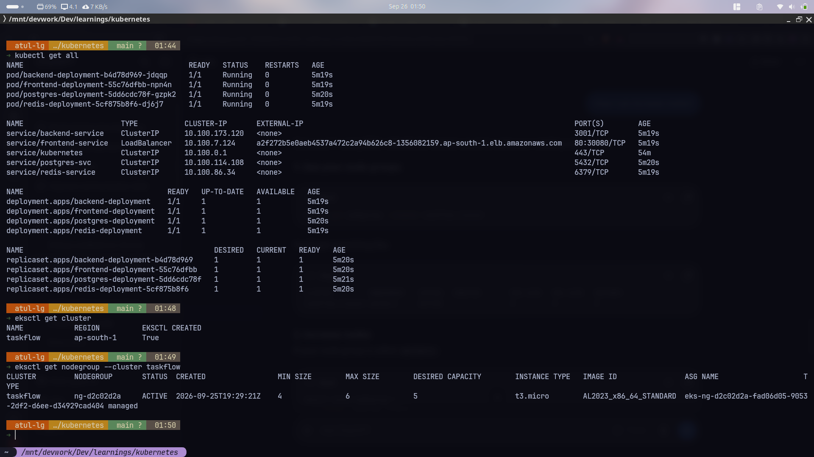
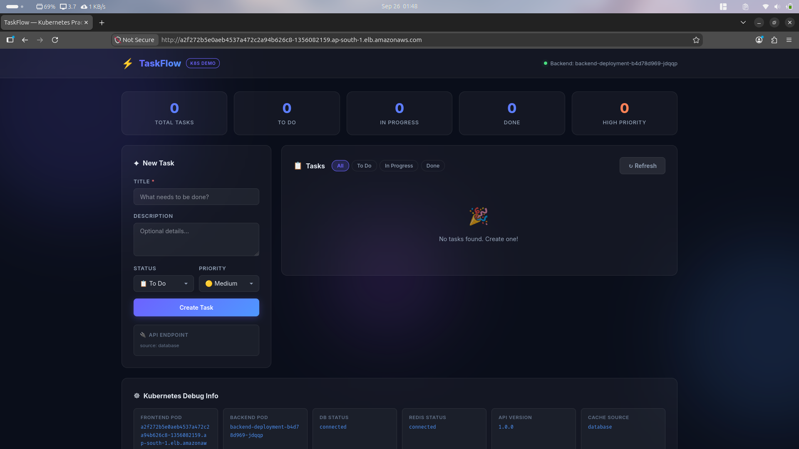
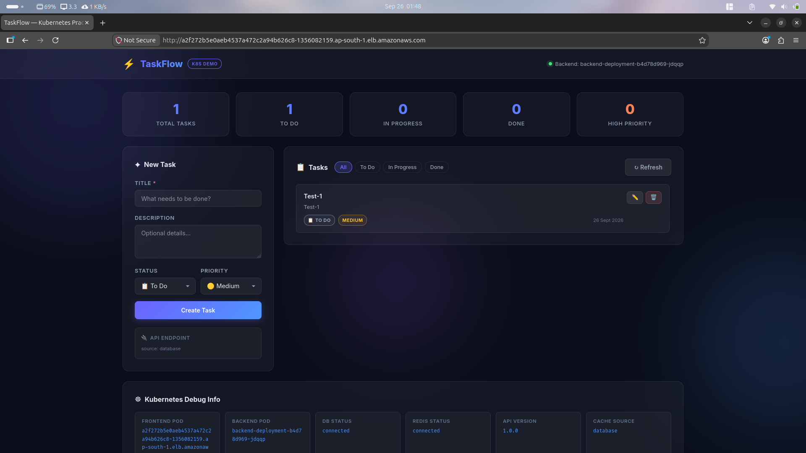

# ☸️ Learning Kubernetes — TaskFlow Practice App

> A hands-on Kubernetes learning project built around **TaskFlow**, a production-style task management application. The repo progresses from raw Docker Compose all the way through multi-tier K8s deployments with PersistentVolumes, ConfigMaps, Secrets, health probes, and more.

---

## 📁 Repository Structure

```
.
├── backend/               # Node.js + Express REST API
│   ├── server.js          # API routes, PG pool, Redis client
│   ├── Dockerfile
│   └── package.json
├── frontend/              # Vanilla JS + HTML/CSS SPA
│   ├── app.js             # API integration & UI logic
│   ├── index.html
│   ├── style.css
│   ├── nginx.conf         # Reverse-proxy for /api/* → backend
│   └── Dockerfile
├── k8s/                   # Production-ready K8s manifests (Minikube / kind)
│   ├── 00-namespace.yaml
│   ├── 01-configmap.yaml
│   ├── 02-secret.yaml
│   ├── 03-postgres-pv.yaml
│   ├── 04-postgres.yaml
│   ├── 05-redis.yaml
│   ├── 06-backend.yaml
│   └── 07-frontend.yaml
├── eks-k8s/               # AWS EKS manifests (LoadBalancer service, public images)
│   ├── 1-configmap.yaml
│   ├── 2-secret.yaml
│   ├── 3-postgres-pv.yaml
│   ├── 4-postgres.yaml
│   ├── 5-redis.yaml
│   ├── 6-backend.yaml
│   └── 7-frontend.yaml    # Service type: LoadBalancer → AWS ALB
├── k8s_prac/              # Stripped-down practice manifests (write your own)
├── Voting-app/            # Classic K8s example app manifests
├── public/                # Screenshots from the live AWS EKS deployment
├── docker-compose.yaml    # Local dev stack (no K8s needed)
├── Makefile               # One-command workflow shortcuts
├── flow.html              # Interactive architecture flow diagram
├── taskflow_architecture.md  # Full architecture & communication breakdown
├── GUIDE.md               # Step-by-step K8s concept guide
└── WRITE_YOUR_OWN.md      # Practice exercises & challenges
```

---

## 🏗️ Application Architecture

TaskFlow is a 4-tier application that demonstrates real-world Kubernetes patterns:

```
Browser
  │
  │ HTTP :30080 (NodePort)
  ▼
┌─────────────────────────────────────────────────────────┐
│  Kubernetes Node (Minikube / kind)                      │
│                                                         │
│  ┌──────────────────┐   nginx proxy_pass /api/*         │
│  │  Frontend (nginx) │ ──────────────────────────────►  │
│  │  × 3 replicas    │                                   │
│  └──────────────────┘   ┌───────────────────────────┐  │
│                          │  Backend (Node.js)         │  │
│                          │  × 3 replicas              │  │
│                          │  ConfigMap + Secret envs   │  │
│                          └──────┬────────────┬────────┘  │
│                                 │            │            │
│                    TCP :5432    │            │  TCP :6379 │
│               ┌─────────────────┘            └──────────┐│
│               ▼                                         ▼│
│     ┌──────────────────┐              ┌──────────────────┐│
│     │  PostgreSQL 15   │              │  Redis 7         ││
│     │  PersistentVolume│              │  (cache only)    ││
│     └──────────────────┘              └──────────────────┘│
└─────────────────────────────────────────────────────────┘
```

> **Nginx as reverse proxy** — The browser only ever talks to nginx on port 80. API calls (`/api/*`, `/health`) are proxied internally to the backend ClusterIP service. The backend is never exposed externally.

---

## 🔌 API Reference

| Method | Endpoint | Description |
|--------|----------|-------------|
| `GET` | `/health` | Health check — reports DB & Redis status |
| `GET` | `/api/tasks` | List all tasks (Redis-cached, 60 s TTL) |
| `GET` | `/api/tasks?status=todo` | Filter tasks by status |
| `GET` | `/api/tasks/:id` | Get a single task |
| `POST` | `/api/tasks` | Create a task `{ title, description, status, priority }` |
| `PUT` | `/api/tasks/:id` | Update task fields (partial update supported) |
| `DELETE` | `/api/tasks/:id` | Delete a task |
| `GET` | `/api/stats` | Dashboard counts by status & priority |

Task `status` values: `todo` · `in_progress` · `done`
Task `priority` values: `low` · `medium` · `high`

---

## 🚀 Quick Start

### Option A — Docker Compose (local dev, no K8s)

```bash
make docker-up        # builds images & starts the stack
# App running at http://localhost:8080
make docker-down      # stop & remove volumes
```

### Option B — Kubernetes (Minikube)

```bash
# 1. Start minikube
minikube start

# 2. Build Docker images & load them into minikube
make minikube-load

# 3. Deploy everything
make deploy

# 4. Watch pods come up
make watch

# 5. Open the app
minikube service frontend-service -n taskflow
# — or — port-forward if NodePort is not accessible:
make port-forward
# App at http://localhost:8080
```

### Option C — Kubernetes (kind)

```bash
kind create cluster
make kind-load        # build + load images into kind
make deploy
make port-forward     # http://localhost:8080
```

### Option D — AWS EKS (via eksctl)

> **Prerequisites:** `eksctl`, `kubectl`, and `aws` CLI installed and configured with appropriate IAM permissions.

```bash
# 1. Create the EKS cluster with a managed node group
eksctl create cluster \
  --name taskflow \
  --region ap-south-1 \
  --nodegroup-name ng-d2c02d2a \
  --node-type t3.micro \
  --nodes 5 \
  --nodes-min 4 \
  --nodes-max 6 \
  --managed

# 2. Verify the cluster and node group
eksctl get cluster
eksctl get nodegroup --cluster taskflow

# 3. Update kubeconfig to point kubectl at the new cluster
aws eks update-kubeconfig --name taskflow --region ap-south-1

# 4. Deploy all EKS manifests in order
kubectl apply -f eks-k8s/1-configmap.yaml
kubectl apply -f eks-k8s/2-secret.yaml
kubectl apply -f eks-k8s/3-postgres-pv.yaml
kubectl apply -f eks-k8s/4-postgres.yaml
kubectl apply -f eks-k8s/5-redis.yaml
kubectl apply -f eks-k8s/6-backend.yaml
kubectl apply -f eks-k8s/7-frontend.yaml

# 5. Watch pods come up
kubectl get all

# 6. Get the AWS Load Balancer URL (takes ~2 min to provision)
kubectl get svc frontend-service
# EXTERNAL-IP will be something like:
# a2f272b5e0aeb4537a472c2a94b626c8-1356082159.ap-south-1.elb.amazonaws.com

# 7. Tear down the cluster (avoids AWS charges)
eksctl delete cluster --name taskflow --region ap-south-1
```

> **Key difference vs. local K8s:** The `eks-k8s/7-frontend.yaml` service uses `type: LoadBalancer` instead of `NodePort`. AWS automatically provisions an Elastic Load Balancer and assigns a public DNS hostname.

---

## 🛠️ Makefile Commands

| Command | Description |
|---------|-------------|
| `make help` | Show all available commands |
| `make build` | Build both Docker images |
| `make minikube-load` | Build & load images into minikube |
| `make kind-load` | Build & load images into kind |
| `make deploy` | Apply all K8s manifests in order |
| `make delete` | Tear down everything (namespace + PV) |
| `make status` | Show pods, deployments, services, PVCs |
| `make watch` | Live pod watch (`kubectl get pods -w`) |
| `make logs SVC=backend` | Tail logs for a service |
| `make port-forward` | Forward frontend-service → localhost:8080 |
| `make docker-up` | Run stack via Docker Compose |
| `make docker-down` | Stop Compose stack & remove volumes |

---

## ☸️ Kubernetes Concepts Covered

| Manifest | Concept |
|----------|---------|
| `00-namespace.yaml` | Namespaces — resource isolation |
| `01-configmap.yaml` | ConfigMaps — non-sensitive env config |
| `02-secret.yaml` | Secrets — sensitive credentials (base64) |
| `03-postgres-pv.yaml` | PersistentVolume + PVC — durable storage |
| `04-postgres.yaml` | Deployment, ClusterIP Service, readiness/liveness probes, `Recreate` strategy |
| `05-redis.yaml` | Deployment, ClusterIP Service, ephemeral in-memory cache |
| `06-backend.yaml` | Deployment (3 replicas), `envFrom` ConfigMap & Secret, startup/readiness/liveness probes |
| `07-frontend.yaml` | Deployment (3 replicas), NodePort Service, nginx reverse proxy |
| `08-standalone-pods.yaml` | Bare Pods — showing what Deployments solve |
| `09-replicaset.yaml` | ReplicaSets — manual scaling before Deployments |

### Service Types Used

| Service | Type | Port | Access |
|---------|------|------|--------|
| `frontend-service` | **NodePort** | 80 → **30080** | 🌐 External browser |
| `backend-service` | **ClusterIP** | 3001 | 🔒 Inside cluster only |
| `postgres-svc` | **ClusterIP** | 5432 | 🔒 Inside cluster only |
| `redis-service` | **ClusterIP** | 6379 | 🔒 Inside cluster only |

---

## 📦 Tech Stack

| Layer | Technology |
|-------|-----------|
| Container Orchestration | Kubernetes (Minikube / kind / **AWS EKS**) |
| Cluster Provisioning | **eksctl** (AWS EKS managed node groups) |
| Local Dev | Docker Compose |
| Backend | Node.js 20, Express 4, `pg`, `redis`, `helmet`, `morgan` |
| Frontend | Vanilla HTML/CSS/JS, Nginx Alpine |
| Database | PostgreSQL 15 Alpine |
| Cache | Redis 7 Alpine |
| Image Registry | Local (Minikube/kind) / **Docker Hub** (EKS) |
| Load Balancing | NodePort (local) / **AWS ELB** (EKS) |

---

## 📚 Learning Resources in This Repo

| File | Purpose |
|------|---------|
| [`GUIDE.md`](./GUIDE.md) | Step-by-step K8s concept guide with explanations |
| [`WRITE_YOUR_OWN.md`](./WRITE_YOUR_OWN.md) | Practice challenges — write manifests from scratch |
| [`taskflow_architecture.md`](./taskflow_architecture.md) | Deep-dive: full architecture, DNS, config injection, health probes |
| [`flow.html`](./flow.html) | Interactive visual flow diagram (open in browser) |
| [`k8s_prac/`](./k8s_prac/) | Stripped manifests for hands-on practice |
| [`Voting-app/`](./Voting-app/) | Classic K8s multi-service voting example |

---

## 🗝️ Key Patterns to Learn From This Project

- **Reverse Proxy Pattern** — Browser → nginx → backend ClusterIP; backend is never exposed externally
- **Config Injection** — All env vars come from ConfigMap & Secret; zero hardcoded credentials in images
- **Durable vs. Ephemeral Storage** — Postgres uses a PV (survives restarts); Redis does not (cache-only)
- **Health Probes** — `startupProbe` gives the app time to boot; `readinessProbe` gates traffic; `livenessProbe` triggers restarts
- **`Recreate` Strategy for Databases** — Prevents two Postgres pods running simultaneously (avoids split-brain)
- **DNS-based Service Discovery** — Pods address each other by service name (`backend-service`, `postgres-svc`) resolved by CoreDNS

---

## 🔧 Environment Variables

The backend reads the following env vars (set via ConfigMap + Secret in K8s, or `environment:` in Compose):

| Variable | Default | Source |
|----------|---------|--------|
| `PORT` | `3001` | ConfigMap |
| `DB_HOST` | `localhost` | ConfigMap |
| `DB_PORT` | `5432` | ConfigMap |
| `DB_NAME` | `taskdb` | ConfigMap |
| `DB_USER` | `postgres` | **Secret** |
| `DB_PASS` | `postgres` | **Secret** |
| `REDIS_HOST` | `localhost` | ConfigMap |
| `REDIS_PORT` | `6379` | ConfigMap |

---

## 🧹 Teardown

```bash
# Kubernetes (Minikube / kind)
make delete

# Docker Compose
make docker-down

# AWS EKS (deletes cluster + all AWS resources)
eksctl delete cluster --name taskflow --region ap-south-1
```

---

## ☁️ AWS EKS Deployment — Screenshots

The TaskFlow app was deployed to a live EKS cluster (`ap-south-1` / Mumbai region) using `eksctl`. Below are screenshots from the deployment.

### EKS Cluster — AWS Console
> Cluster `taskflow` running Kubernetes v1.34 on EKS in `ap-south-1`.



### EC2 Worker Nodes
> 5 × `t3.micro` worker nodes provisioned by the managed node group `ng-d2c02d2a`, spread across AZs `ap-south-1a`, `ap-south-1b`, and `ap-south-1c`.



### Terminal — `kubectl get all` + `eksctl` commands
> All pods running, services showing the AWS ELB hostname as `EXTERNAL-IP` for `frontend-service` (type: `LoadBalancer`).



### Live App — TaskFlow via AWS Load Balancer
> App accessible at the public ELB DNS. Backend pod name and DB/Redis connectivity confirmed in the Kubernetes Debug Info panel.




