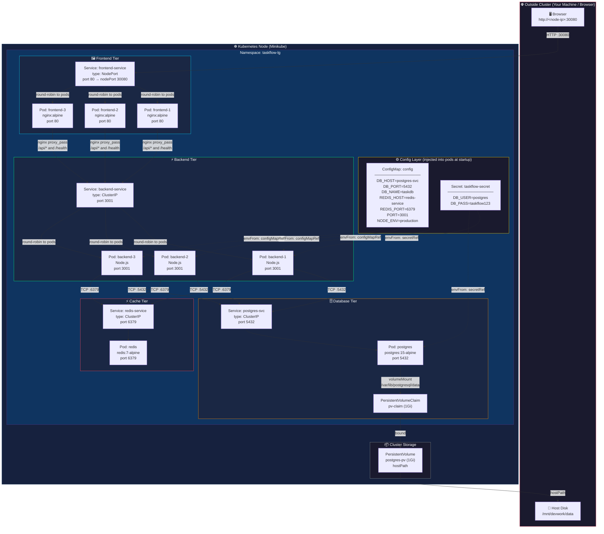

# TaskFlow — Full K8s Architecture & Communication Flow

## Namespace: `taskflow-lg`

All resources (except the PersistentVolume) live inside the `taskflow-lg` namespace.

---

## Full Architecture Diagram



---

## Step-by-Step Communication Breakdown

### 1️⃣ Browser → Frontend Service (NodePort)

```
Browser: GET http://<node-ip>:30080/
    │
    ▼
frontend-service (NodePort 30080 → port 80)
    │  K8s kube-proxy rewrites the packet
    │  and load-balances to one of 3 frontend pods
    ▼
frontend-pod-X  (nginx, port 80)
    → serves index.html, style.css, app.js
```

> **Key**: NodePort punches a hole through the node's firewall so external traffic can reach the cluster.

---

### 2️⃣ Browser → Nginx → Backend Service (API calls)

```
Browser JS: fetch('/api/stats')        ← relative URL, no hostname
    │
    │  HTTP GET /api/stats  (same origin = nginx on port 80)
    ▼
nginx inside frontend-pod-X
    │  nginx.conf location /api/ {
    │      proxy_pass http://backend-service:3001/api/;
    │  }
    │
    │  K8s internal DNS resolves "backend-service" → ClusterIP
    ▼
backend-service (ClusterIP, port 3001)
    │  K8s iptables rules load-balance to one of 3 backend pods
    ▼
backend-pod-Y  (Node.js, port 3001)
    → processes request, queries DB/Cache
    → returns JSON response
```

> **Key**: The browser never talks to the backend directly. Nginx is the middleman — this is the **reverse proxy pattern**.

---

### 3️⃣ Backend Pod → PostgreSQL

```
backend-pod-Y
    │  uses env var DB_HOST="postgres-svc"  ← from ConfigMap
    │  uses env var DB_PORT="5432"          ← from ConfigMap
    │  uses env var DB_USER                 ← from Secret
    │  uses env var DB_PASS                 ← from Secret
    │
    │  TCP connection to postgres-svc:5432
    ▼
postgres-svc (ClusterIP, port 5432)
    ▼
postgres-pod (single replica, Recreate strategy)
    │  reads/writes data to mounted volume
    ▼
PVC (pv-claim) → PV (postgres-pv) → /mnt/devwork/data on host disk
```

> **Key**: Data survives pod restarts because it's on a PersistentVolume on the host disk. `Recreate` strategy ensures only one postgres pod runs at a time (no split-brain).

---

### 4️⃣ Backend Pod → Redis

```
backend-pod-Y
    │  uses env var REDIS_HOST="redis-service"  ← from ConfigMap
    │  uses env var REDIS_PORT="6379"           ← from ConfigMap
    │
    │  TCP connection to redis-service:6379
    ▼
redis-service (ClusterIP, port 6379)
    ▼
redis-pod (single replica)
    → in-memory key-value store (used for caching)
```

> **Key**: Redis has **no PersistentVolume** — its data is lost if the pod restarts. It's intentionally ephemeral (cache only).

---

## Service Type Summary

| Service | Type | Port | Accessible From |
|---|---|---|---|
| `frontend-service` | **NodePort** | 80 → **30080** | 🌐 External (browser) |
| `backend-service` | **ClusterIP** | 3001 | 🔒 Inside cluster only |
| `postgres-svc` | **ClusterIP** | 5432 | 🔒 Inside cluster only |
| `redis-service` | **ClusterIP** | 6379 | 🔒 Inside cluster only |

> ClusterIP = only reachable within the cluster. The backend, postgres, and redis are **never exposed to the internet**.

---

## Config Injection Flow

```
At pod startup, Kubernetes injects env vars:

backend pods ←── envFrom: configMapRef (config)
             ←── envFrom: secretRef (taskflow-secret)

postgres pod ←── env.POSTGRES_USER  from Secret key DB_USER
             ←── env.POSTGRES_DB    from ConfigMap key DB_NAME
             ←── env.POSTGRES_PASSWORD from Secret key DB_PASS
```

This means **no hardcoded credentials** in any container image.

---

## DNS Resolution (How Services Find Each Other)

Inside the `taskflow-lg` namespace, K8s CoreDNS automatically resolves:

| DNS Name | Resolves To |
|---|---|
| `backend-service` | ClusterIP of backend-service |
| `postgres-svc` | ClusterIP of postgres-svc |
| `redis-service` | ClusterIP of redis-service |

Full form: `backend-service.taskflow-lg.svc.cluster.local` (but short names work within same namespace)

---

## Health Probes (How K8s Knows Pods Are Ready)

| Pod | Probe | Endpoint | Effect |
|---|---|---|---|
| backend | startupProbe | `GET /health` | Waits up to 300s before other probes start |
| backend | readinessProbe | `GET /health` | Pod removed from Service endpoints if failing |
| backend | livenessProbe | `GET /health` | Pod restarted if failing |
| postgres | readinessProbe | `pg_isready` command | Removed from service if not ready |
| redis | readinessProbe | `redis-cli ping` | Removed from service if not ready |
| frontend | readinessProbe | `GET /` | Removed from service if nginx not serving |
